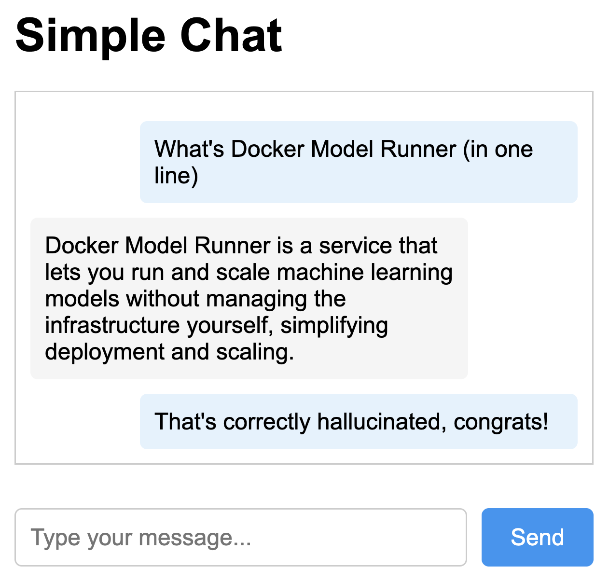
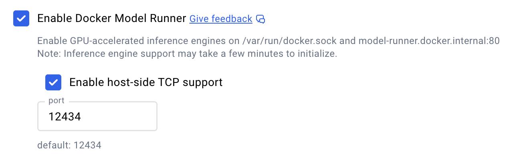

# docker-model-runner-langchain4j

A minimal Java + HTML + JS chat app that shows how to use **Docker Model Runner** as a local LLM backend — fully integrated with [LangChain4j](https://github.com/langchain4j/langchain4j).

Runs locally, uses your GPU (if available), and doesn’t depend on any cloud APIs.



---

## Features

- 🧠 LangChain4j + local LLMs via Docker
- 🐳 Uses Docker Model Runner (lets you pull gemma3, phi4, DeepSeek, ...)
- ⚡ GPU acceleration (if available)
- 🔂 Chat memory retains 15 messages
- 🍃 Pure Java + vanilla JS + basic HTML
- 🧰 Minimal dependencies: Jackson + LangChain4j only

---

## Prerequisites

- Java 17+
- Docker Desktop **4.40+** (macOS / coming to Windows soon)
- Maven or Gradle
- [Enable Model Runner feature](#enable-docker-model-runner)

---

## 🚀 Quickstart

### 1. Enable Docker Model Runner

Go to Docker Desktop settings and enable the following:

> ✅ `Settings → Features in Development → Enable Model Runner`  
> ✅ `Enable host-side TCP support` (default port: `12434`)



---

### 2. Pull a Model

```bash
docker model pull ai/gemma3
```
or any other from [Docker Hub AI](https://hub.docker.com/r/ai/)

Once a model is pulled, it can be ran at anytime. Verify with:

```bash
docker model list
```

---

### 3. Build & Run

#### Maven

```bash
mvn clean compile exec:java
```

#### Gradle

```bash
./gradlew run
```

Now open [http://localhost:8080](http://localhost:8080) and start chatting.

---

## 💡 Where the Integration Happens

If you're curious where the link to the local model is made, it's `ChatServer.java` code:

```java
OpenAiChatModel.builder()
    .apiKey("not needed")
    .baseUrl("http://localhost:12434/engines/llama.cpp/v1")
    .modelName("ai/gemma3") // or any pulled model
    .build();
```

It uses the Docker Model Runner's OpenAI-compatible endpoint (on port `12434`) to route requests to your local model.

---

## Changing Models

To use a different model:

```bash
docker model pull ai/llama3.2:latest
```

Then update the code:

```java
.modelName("ai/llama3.2:latest")
```

And run the app again.

